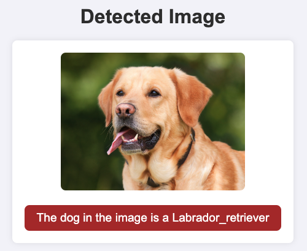
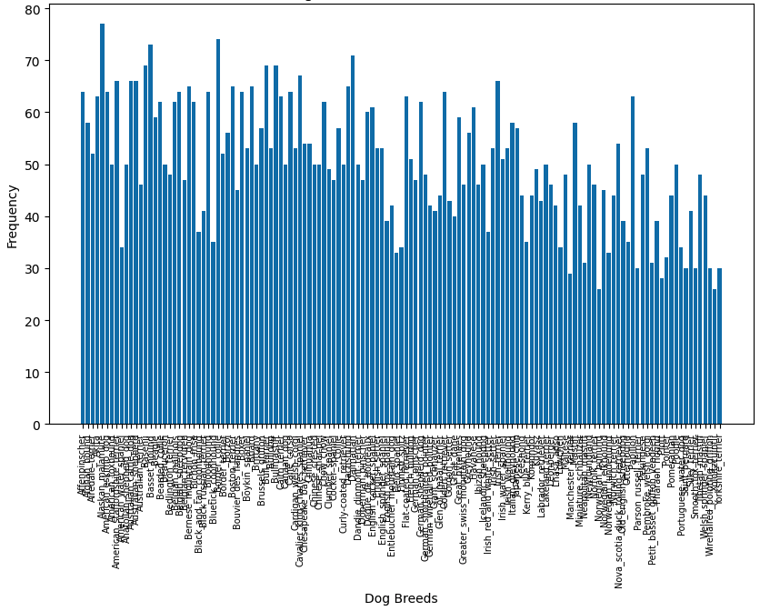

### Table of Contents

1. [Introduction](#introduction)
2. [Insights](#process)
3. [Prerequisites](#prerequisites)
4. [Instructions](#instructions)
5. [Main Components](#files)
6. [Files](#filetree)
7. [Licensing, Authors, and Acknowledgements](#licensing)

## Introduction <a name="introduction"></a>
This Repository provides a web app that detects a dog breed from an uploaded image using a Convolutional Neural Network (CNN). If a human is detected
instead of a dog, the most resembling dog breed is given. If neither a dog nor a human is detected, an error message
is displayed.

The CNN was trained using Transfer Learning with Bottleneck Features. The Notebook dog_app.ipynb serves as 
provides the training of the CNN (amongst others). The file utils.py and the Flask-App in app.py are built 
on insights/models from the notebook.

## Insights <a name="process"></a>
#### Definition
This project served as a training for applying CNN's to real-world data, specifically images. 
In the Notebook, multiple models and approaches were tested, which served as a great learning experience.

#### Occurence of Target Labels (Dog Breeds) in the Training Dataset

The Distribution of Dog Breeds seems to be relatively balanced. While some dog breeds occur more often than
others, there appears to be no stark outlier. This is an important insight for the further process, specifically
the metric to be used througout this project.

#### Metric 
Since the target labels in the training dataset are relatively balanced, ACCURACY is chosen as the metric to be used throughout this Notebook. Furthermore, for multi-label classification tasks like this one, other metrics such as F-1 scores become even more difficult to calculate and interpret. 
Accuracy is defined as simply the percentage of correctly classified labels, which makes it an easily interpretable metric (contrary to F-1 scores, for instance). 

The wide usage of accuracy in a business context further justifies its usage. Therefore, all models
in this project are benchmarked on accuracy.

#### Model Comparison
| Model    | Bottleneck Features | Test Accuracy | Use in Web App | Comment                                                                                                                                                                                         |
|----------|---------------------|---------------|----------------|-------------------------------------------------------------------------------------------------------------------------------------------------------------------------------------------------|
| VGG16    | No                  | 1 %           | No             | Building from scratch achieves low accuracy.                                                                                                                                                    |
| VGG16    | Yes                 | 73 %          | No             | Adding Bottleneck Features greatly improves metric.                                                                                                                                             |
| VGG19    | Yes                 | 73 %          | Yes            | Used in Web App because of reliable prediction in local setup.                                                                                                                                  |
| ResNet50 | Yes                 | 82 %          | No             | Tried using in Web App. Not working because of dependency issues between Bottleneck Feature and newer Keras versions. See known issue in [here](https://knowledge.udacity.com/questions/50372). |


The web app utilises a VGG19 CNN. This model achieved
an accuracy score of about 73% (see Notebook). A higher score of about 83% was achieved with RestNet50; however, this
model could not be deployed due to some dependency-issues with the bottleneck features in a higher Keras version
(greater than 2.0.2). Hence, the VGG19 model was used. 
For different approaches and models, please refer to the provided Notebook.

#### Conclusion
One of the most fascinating insights from this project was the use of transfer learning, which 
improved the test accuracy from 1% to 73% (even 83% with ResNet50). This shows the great advantage
of training on large datasets, even when predicting entirely different classes (through the removal of 
the last layers of the trained model). In the future, the provided algorithm could be further improved by
- detection of both dog AND human in the same picture,
- detection of multiple dog breeds in the same picture (after reaching a certain confidence threshold)
- highlighting distinct features directly in the image (e.g. like for the face detector, highlight areas that are distinctive for this specific breed).

## Prerequisites<a name="prerequisites"></a>

To install the requirements in requirements.txt, run
```
pip install -r requirements.txt
```
IMPORTANT: The bottleneck features are too large to be stored on Github, so you
need to store them in the directory bottleneck_features/ as a .npz-file with the name DogVGG19Data.npz. You can download the 
bottleneck features [here](https://s3-us-west-1.amazonaws.com/udacity-aind/dog-project/DogVGG19Data.npz).

The Face-Detector relies on a pre-saved Haarcascade-model, which must be stored in data/haarcascades/ as an .xml-file.

Furthermore, a pre-trained Resnet50 model and a pre-trained VGG19-model must be stored in saved_models/ as .hdf5-files.

## Instructions<a name="instructions"></a>
Start the Flask web app with 
```
python run app.py
```
Visit the Website at http://127.0.0.1:5000/.
Here, you can upload an image and predict the dog breed through a click.


## Main Components <a name="files"></a>
#### utils.py
Contains all the necessary functions for the web app to work. Accesses multiple pre-trained models 
and bottleneck features (see description above). 

#### dog_app.ipynb
The Jupyter Notebook which served as a starting point for this project. Here, the pre-trained models
used in utils.py are actually trained and more context is provided. 

#### app.py
Generates the Flask-Web-App. The user can upload an image and the Neural Network will predict the 
dog breed (if a dog or even human is detected). 

## Files<a name="filetree"></a>
```
.
|-- LICENSE
|-- README.md
|-- __pycache__
|   |-- extract_bottleneck_features.cpython-38.pyc
|   `-- utils.cpython-38.pyc
|-- app.py
|-- bottleneck_features
|   `-- DogVGG19Data.npz
|-- data
|   |-- haarcascades
|   |   `-- haarcascade_frontalface_alt.xml
|   `-- images
|-- dog_app.ipynb
|-- extract_bottleneck_features.py
|-- file_tree.md
|-- requirements.txt
|-- saved_models
|   |-- Resnet50.hdf5
|   `-- VGG19.hdf5
|-- templates
|   |-- display.html
|   `-- upload.html
`-- utils.py
```

## Licensing, Authors, Acknowledgements<a name="licensing"></a>
Licensed under the MIT license and provided by [Udacity](https://www.udacity.com). The test picture
of the dog above originates from [phys.org](https://phys.org/news/2018-10-good-dog-canine-aptitude-clues.html).

